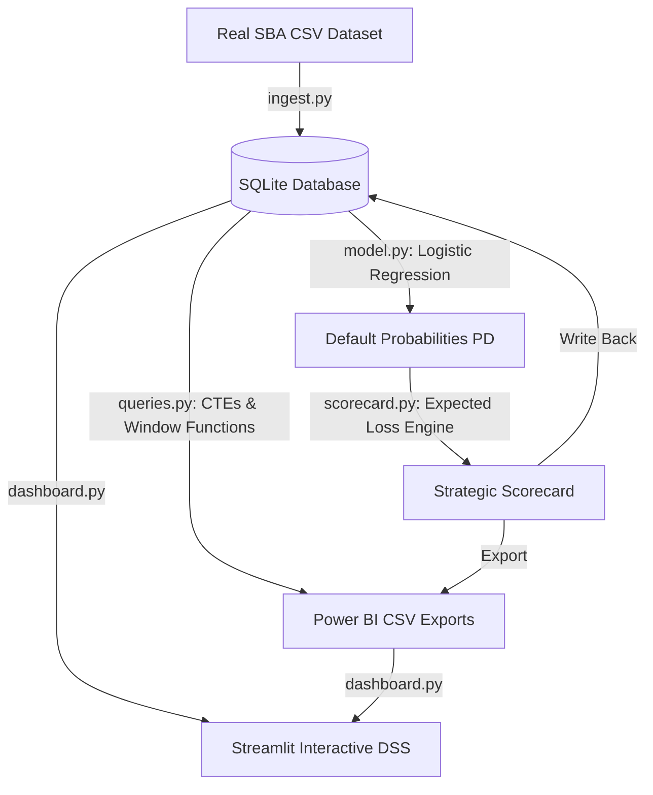

# SBA Credit Risk Decision Support System (DSS)

An enterprise-grade **Credit Risk Decision Support System** built to help financial institutions optimize portfolio growth while minimizing credit risk. The project utilizes a real-world, high-volume dataset from the Small Business Administration (SBA) 7(a) loan program, covering FY2020 to Present, to model borrower risk, calculate Expected Loss, and generate strategic underwriting policy recommendations.

---

## 1. Data Source & Dataset Specifications

* **Source**: Official SBA Loan-Level Dataset (SBA FOIA data portal: [data.sba.gov](https://data.sba.gov/))
* **Database File Used**: `data/FOIA_7a_FY2020_Present_asof_260630.csv` (~172MB)
* **Official Data Dictionary**: `data/7a_504_FOIA_Data_Dictionary.xlsx`
* **Dataset Scope**: Covers all approved 7(a) loans from Fiscal Year 2020 to June 30, 2026.
* **Sampling**: For optimal database performance and memory speed, the pipeline ingests the **first 100,000 rows** of this dataset as a representative real-world sample for modeling and analytics.

---

## 2. Business Objective & Credit Risk Framework

Standard risk modeling often centers on predicting defaults in isolation. This system frames the problem strategically: **how can a lender optimize portfolio yield and expand lending volume without exposing itself to catastrophic credit write-offs?**

To solve this, the system evaluates risk on two dimensions:
1. **Probability of Default (PD)**: The relative likelihood of a borrower defaulting, predicted using a machine learning classifier.
2. **Expected Loss (EL)**: The absolute financial exposure of the loan, defined as:
   $$\text{Expected Loss (EL)} = \text{PD} \times \text{Gross Loan Amount}$$
   *(Note: This assumes a Loss Given Default (LGD) of 100% of the loan amount for conservative risk provisioning).*

This dual-risk framework enables the bank to segment its market into three credit policy strategies:
* **GROW**: Segments with low default rates ($<6\%$) and low financial exposure. Underwriting rules are relaxed (e.g., expedited approvals, higher leverage ratios) to capture market share.
* **MAINTAIN**: Segments with moderate default rates ($6\% - 13\%$). Standard credit policy rules apply.
* **TIGHTEN**: Segments with high default rates ($>13\%$) or high expected loss concentration (top 10% overall). Underwriting is tightened (e.g., higher secondary collateral, mandatory manual reviews, higher debt-service coverage ratio requirements).

---

## 3. System Architecture & Data Pipeline

The pipeline is organized as an automated ETL, modeling, and analytics suite:



1. **ETL Pipeline (`src/ingest.py`)**: Ingests, parses, and cleans the real SBA loan records, standardizing columns (GrossApproval, TermInMonths, NaicsCode, BorrState, ApprovalDate, LoanStatus) and writes them to a SQLite database (`data/sba_loans.db`).
2. **SQL Analytics Engine (`src/queries.py`)**: Leverages Common Table Expressions (CTEs) and Window Functions to compute and rank risk parameters across industries and states.
3. **Predictive Modeling (`src/model.py`)**: Trains an interpretable Logistic Regression model to predict default probabilities, extracts feature importances, and scores all database loans.
4. **Expected Loss & Scorecard Engine (`src/scorecard.py`)**: Aggregates the scored database by NAICS-State segment, calculates expected losses, applies the policy rule, and exports dashboards/Power BI datasets.
5. **Fintech Dashboard (`dashboard.py`)**: A Streamlit app containing KPI metrics, heatmaps, lending trends, filterable scorecards, and a loan underwriting simulator.

---

## 4. SQL Analytics Methodology

The analytics engine uses advanced SQLite queries to rank states and industries by risk.

### Industry Risk Ranking Query
This query uses a **CTE** to group loans by NAICS 2-digit industry code and count defaulted vs. resolved loans, and uses the **`DENSE_RANK()` window function** to rank them by default rate:
```sql
WITH industry_stats AS (
    SELECT 
        naics_sector,
        COUNT(*) as total_loans,
        SUM(CASE WHEN status = 'default' THEN 1 ELSE 0 END) as defaulted_loans,
        SUM(CASE WHEN status IN ('default', 'paid-in-full') THEN 1 ELSE 0 END) as resolved_loans,
        AVG(loan_amount) as avg_loan_amount,
        SUM(loan_amount) as total_portfolio_amount
    FROM sba_loans
    GROUP BY naics_sector
)
SELECT 
    naics_sector,
    total_loans,
    defaulted_loans,
    resolved_loans,
    CASE WHEN resolved_loans > 0 
         THEN ROUND((defaulted_loans * 100.0 / resolved_loans), 2) 
         ELSE 0.0 
    END as default_rate_pct,
    ROUND(avg_loan_amount, 2) as avg_loan_amount,
    ROUND(total_portfolio_amount, 2) as total_portfolio_amount,
    DENSE_RANK() OVER (ORDER BY CASE WHEN resolved_loans > 0 THEN defaulted_loans * 100.0 / resolved_loans ELSE 0.0 END DESC) as risk_rank
FROM industry_stats
ORDER BY risk_rank ASC;
```

---

## 5. Machine Learning & Risk Explainability

### Model Details
* **Algorithm**: Logistic Regression (L2 regularization) chosen for its high interpretability, smooth probability outputs, and regulatory compliance.
* **Target Variable**: Default status (`1` for default, `0` for paid-in-full). Active/Current loans (such as those in `EXEMPT` status) are excluded from training to avoid label bias but are scored in inference.
* **Features**:
  * `loan_amount` (Standardized float)
  * `term_months` (Standardized float)
  * `naics_sector` (One-hot encoded categorical)
  * `state` (One-hot encoded categorical)

### Performance on Real SBA Data
* **Resolved Loans (Train/Test Size)**: 45,739
* **SBA Historical Sample Default Rate**: 6.48%
* **Model Classification Accuracy**: 68.06%
* **Sensitivity / Default Recall**: **74.03%** (strong ability to capture true defaults)
* **Area Under the ROC Curve (ROC-AUC)**: **0.7768** (high predictive power for business scorecards)

### Business-Friendly Risk Explanations
Instead of raw mathematical coefficients, the simulator translates model parameters into plain-English drivers:
* **Industry Sector**: Industries like Accommodation & Food Services (NAICS 72) show positive coefficients, indicating structurally higher risk. Healthcare (NAICS 62) has negative coefficients, reducing risk.
* **Loan Amount**: Larger loan sizes have a negative risk coefficient. This reflects the reality that larger loans undergo rigorous banking covenants and extensive collateral backing, lowering their probability of default.
* **Loan Term**: Longer loan terms (e.g., 240+ months) reduce the probability of default, as they are typically backed by physical real estate assets. Short-term loans (e.g., < 60 months) increase risk due to rapid cash amortization pressures.

---

## 6. Dashboard Capabilities

Run the Streamlit application to access:
* **Executive Summary**: High-level KPIs (Portfolio Size, Average Default Rate, Expected Loss, Growth Count) and automated policy recommendations.
* **Risk Heatmaps & Trends**: Interactive grids showing default rates and absolute expected loss distributions by state and NAICS, alongside time-series lending trends.
* **Segment Scorecard**: Fully filterable and searchable database of segment recommendations (Grow/Maintain/Tighten) color-coded for fast analysis.
* **Underwriting Simulator**: Real-time loan scoring tool where underwriters can test custom loan parameters to get the PD, Expected Loss, and policy action with structured explanations.

---

## 7. How to Run the Project

### Prerequisites
Make sure Python (3.9+) is installed.

### Setup and Execution
1. **Clone or Navigate to Project Directory**:
   ```bash
   cd C:\Users\mythi\.gemini\antigravity\scratch\sba_credit_risk
   ```

2. **Install Dependencies**:
   ```bash
   pip install -r requirements.txt
   ```

3. **Execute Data Pipeline**:
   Run the orchestrator to clean raw real data, build SQLite views, and train the ML model:
   ```bash
   python run_pipeline.py
   ```

4. **Launch Streamlit Dashboard**:
   ```bash
   streamlit run dashboard.py
   ```

---

## 8. Power BI Integrations

All datasets generated by the pipeline are exported to `data/powerbi_exports/` in CSV format. These files are clean, flattened, and optimized for importing directly into Power BI:
- `industry_risk_ranking.csv`: Industry rankings based on default rates.
- `state_risk_ranking.csv`: State rankings based on default rates.
- `segment_scorecard.csv`: State-Industry combinations with risk-vs-growth recommendations.
- `expected_loss_summary.csv`: Aggregated Expected Loss and exposure metrics by industry.
- `model_feature_importance.csv`: Feature coefficients for modeling visuals.

---

## 9. Limitations & Future Extensions

* **LGD Simplification**: The system assumes LGD is 100%. In a production environment, LGD should be modeled as a continuous variable between 0% and 100% based on historical recovery rates and collateral types.
* **Macroeconomic Factors**: The current model does not ingest inflation, unemployment, or Fed interest rates. Incorporating these would capture cyclical default behaviors.
* **Survival Modeling**: Logistic regression is a static classification tool. Implementing survival analysis (e.g., Cox Proportional Hazards) would predict *when* a loan is likely to default over its term.
